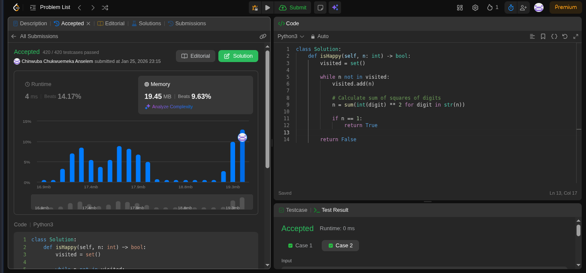

# Happy Number

### Goal

Write an algorithm to determine if a number `n` is "happy". A happy number is a number defined by the following process:
1. Starting with any positive integer, replace the number by the sum of the squares of its digits.
2. Repeat the process until the number equals 1 (where it will stay), or it loops endlessly in a cycle which does not include 1.
3. Those numbers for which this process ends in 1 are happy.

Return `true` if `n` is a happy number, and `false` if not.

[Question](https://leetcode.com/problems/happy-number/)

## Approach

I realized that as I repeatedly sum the squares of the digits, there are only two possibilities: either the number eventually reaches `1`, or it enters a repetitive cycle (an infinite loop) and never reaches `1`.

To handle this, I used a **Hash Set** to track every number I encountered in the sequence. In each step of the `while` loop:
1. If the number is `1`, I return `True`.
2. If the number is already in my `visited` set, I know I'm stuck in a loop, so I return `False`.
3. Otherwise, I add the number to the set and calculate the next number.

## Complexity Analysis

* **Time Complexity:** $$O(\log N)$$. Calculating the next number involves processing the digits, and the number of digits is logarithmic relative to the value.
* **Space Complexity:** $$O(\log N)$$, as we store the numbers in the sequence in our set.

## Implementation

```python
class Solution:
    def isHappy(self, n: int) -> bool:
        visited = set()
        
        while n not in visited:
            visited.add(n)
            
            # Calculate sum of squares of digits
            n = sum(int(digit) ** 2 for digit in str(n))
            
            if n == 1:
                return True
                
        return False
```
## Result

