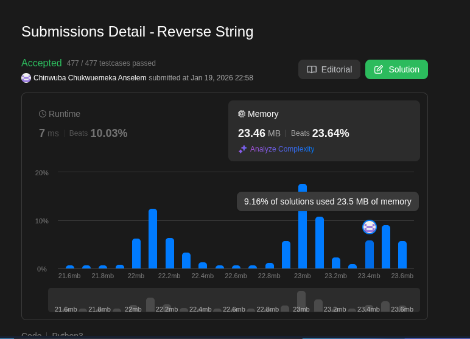

# Reverse String

[Question](https://leetcode.com/problems/reverse-string/)

## Approach

The problem asks us to reverse a string in-place with $$O(1)$$ extra memory. To solve this efficiently, I used a **Two Pointer** strategy.

* I initialized two pointers, `i` and `j`. Pointer `i` starts at the beginning of the string (`0`), and pointer `j` starts at the end (`len(s) - 1`).
* I iterate using a `while` loop that continues as long as `i < j`.
* **Swapping logic:**
    * Inside the loop, I use Python's tuple unpacking to swap the characters `s[i]` and `s[j]` simultaneously. This avoids the need for an explicit temporary variable.
    * After swapping, I increment `i` to move right and decrement `j` to move left.
* The loop terminates when the pointers meet in the middle, ensuring every character has been swapped with its counterpart.

## Complexity Analysis

* **Time Complexity:** $$O(N)$$
    * We iterate through roughly half of the list elements ($N/2$) to perform the swaps.
* **Space Complexity:** $$O(1)$$
    * We perform the operation in-place and only use two integer pointers (`i`, `j`) for storage.

## Implementation

```python3
class Solution:
    def reverseString(self, s: List[str]) -> None:
        """
        Do not return anything, modify s in-place instead.
        """
        i = 0 # left pointer 
        j = len(s) - 1  # right pointer 

        # Continue looping as long as the left pointer is to the left of the right pointer.
        while i < j:
            # This swaps the values at index i and index j simultaneously.
            s[i],s[j] = s[j],s[i]
            i += 1
            j -= 1

```
 
## Result
