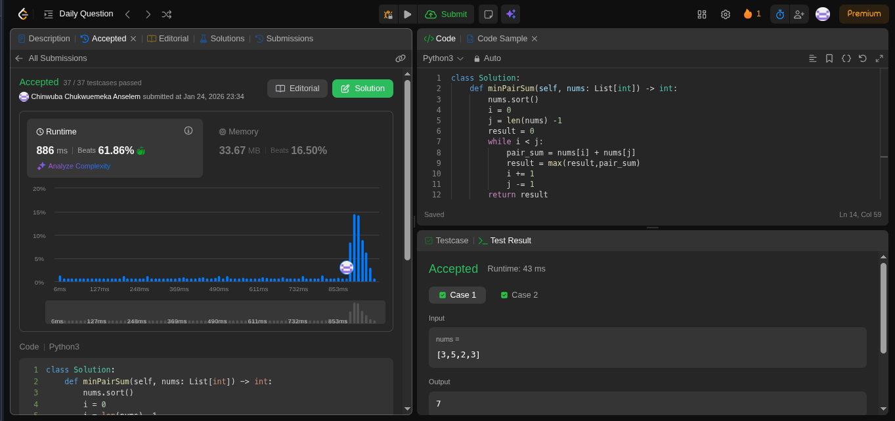

# Minimize Maximum Pair Sum in Array
[Question](https://leetcode.com/problems/minimize-maximum-pair-sum-in-array/)

### Goal
The goal is to divide an array of even length `n` into `n / 2` pairs such that each element belongs to exactly one pair. We want to minimize the maximum pair sum among all the pairs.

## Approach
I decided to use a greedy approach to solve this problem. To minimize the maximum pair sum, I realized that I needed to avoid pairing two large numbers together. The optimal strategy is to pair the smallest number with the largest number, the second smallest with the second largest, and so on.

I achieved this by sorting the array in ascending order first. Then, I used a two-pointer technique with one pointer starting at the beginning (`i`) and one at the end (`j`). In each iteration, I calculated the sum of `nums[i] + nums[j]` and updated the maximum result found so far.

## Complexity Analysis
* Time complexity: $$O(N \log N)$$ due to the sorting step. The two-pointer traversal takes $$O(N)$$ time, so the dominant factor is the sort.
* Space complexity: $$O(1)$$ as I only used a constant amount of extra space for the pointers and result variable (ignoring the space required for sorting).

## Implementation
```python
class Solution:
    def minPairSum(self, nums: List[int]) -> int:
        nums.sort()
        i = 0
        j = len(nums) -1
        result = 0
        while i < j:
            pair_sum = nums[i] + nums[j]
            result = max(result,pair_sum)
            i += 1
            j -= 1
        return result
        
```
## Result 
